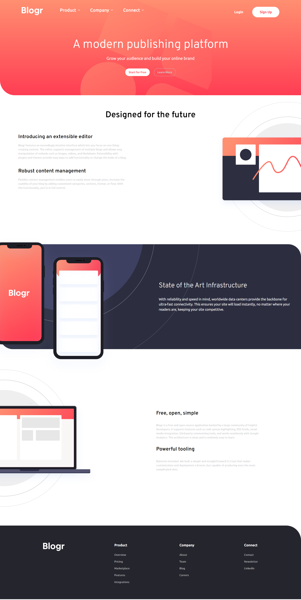

# Frontend Mentor - Blogr landing page solution

This is a solution to the [Blogr landing page challenge on Frontend Mentor](https://www.frontendmentor.io/challenges/blogr-landing-page-EX2RLAApP). Frontend Mentor challenges help you improve your coding skills by building realistic projects. 

## Table of contents

- [Overview](#overview)
  - [The challenge](#the-challenge)
  - [Screenshot](#screenshot)
  - [Links](#links)
- [My process](#my-process)
  - [Built with](#built-with)
  - [What I learned](#what-i-learned)
  - [Continued development](#continued-development)
  - [Useful resources](#useful-resources)
- [Author](#author)
- [Acknowledgments](#acknowledgments)

## Overview

### The challenge

Users should be able to:

- View the optimal layout for the site depending on their device's screen size
- See hover states for all interactive elements on the page

### Screenshot



### Links

- Solution URL: [Github repo](https://github.com/Robertron624/blogr-landing-page)
- Live Site URL: [Add live site URL here](https://your-live-site-url.com)

## My process

### Built with

- Semantic HTML5 markup
- CSS custom properties
- Flexbox
- CSS Grid
- Mobile-first workflow
- Vanilla JavaScript (no libraries)

### What I learned

With this project I wanted to focus on using vanilla JavaScript to create the mobile menu accordions. I also was able to keep my layout skills up. I feel like I accomplished both of these goals. I also wanted to focus on using CSS custom properties to make the code more readable and easier to maintain. I feel like I accomplished this as well. I will continue to use these techniques going forward.

footer links hover effect code, I used position relative and absolute along side after pseudo class to create the hover effect.
```css
    footer .footer-links ul li a{
        display: flex;
        flex-direction: column;
        position: relative;
        width: fit-content;
    }

    footer .footer-links ul li a::after {
        content: "";
        height: 2px;
        width: 0%;
        background-color: var(--white);
        margin-inline: auto;
        transition: all 0.3s ease-in-out;
        position: absolute;
        bottom: -2px;
    }

    footer .footer-links ul li a:hover::after {
        width: 100%;
    }
```

Code for the mobile menu accordions. I used a pattern I found on CodePen to create the accordions. I used plain JavaScript to create the accordions.
```js
const accordions = document.querySelectorAll('.mobile-accordion');

function openAccordion (accordion) {
    const content = accordion.querySelector('.mobile-accordion-content');
    const accordionArrow = accordion.querySelector('.mobile-accordion-button img');
    
    accordion.classList.add('accordion-active');

    content.style.maxHeight = content.scrollHeight + 'px';

    accordionArrow.style.transform = 'rotate(180deg)';
}

function closeAccordion (accordion) {
    const content = accordion.querySelector('.mobile-accordion-content');

    const accordionArrow = accordion.querySelector('.mobile-accordion-button img');

    accordion.classList.remove('accordion-active');

    accordionArrow.style.transform = 'rotate(0deg)';

    content.style.maxHeight = null;
}

accordions.forEach(accordion => {

    const accordionTrigger = accordion.querySelector('.mobile-accordion-button');

    const content = accordion.querySelector('.mobile-accordion-content');

    accordionTrigger.addEventListener('click', () => {
    
        if(content.style.maxHeight) {
            closeAccordion(accordion);
        }
        else {
            accordions.forEach(accordion => {
                closeAccordion(accordion);
            });

            openAccordion(accordion);
        }
    });
});
```
### Continued development

To this date 15 July 2023, I hace completed all junior frontend mentor projects, I want to start working exclusively intermediate projects. I will continue to use vanilla JavaScript and plain CSS if the project does not require a complex logic. If that is not the case then I want to focus on another JavaScript framework like AngularJs or Vue. I also want to focus on using SASS preprocessors to make my CSS more readable and easier to maintain.

### Useful resources

- [CodePen Home Vanilla Javascript animated accordion](https://codepen.io/dusanralic/pen/PoqGKLM) - This helped me to easily create the mobile menu accordions with plain JavaScript and CSS. I really liked this pattern and will use it going forward.

## Author

- Personal Website - [Robert Ramirez](https://robert-ramirez.netlify.app)
- Frontend Mentor User- [@Robertron624](https://www.frontendmentor.io/profile/Robertron624)
- Twitter - [@robertdowny](https://www.twitter.com/robertdowny)

## Acknowledgments

[Dusan Ralic](https://codepen.io/dusanralic/pen/PoqGKLM) - This helped me to easily create the mobile menu accordions with plain JavaScript and CSS. His soluction was very easy to understand and implement.